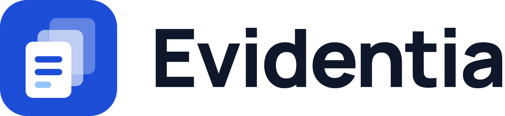
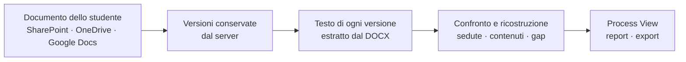
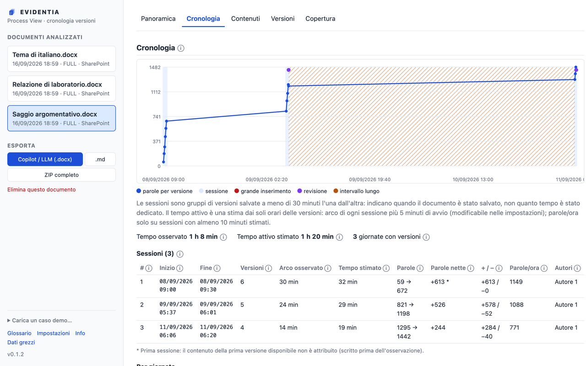
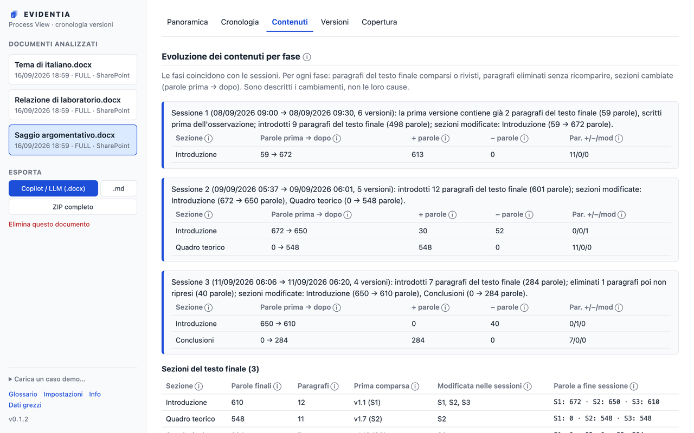
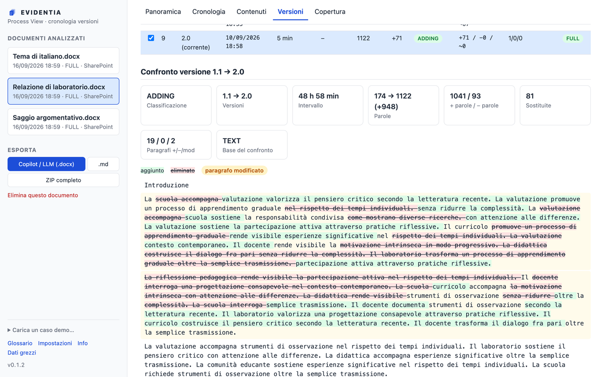
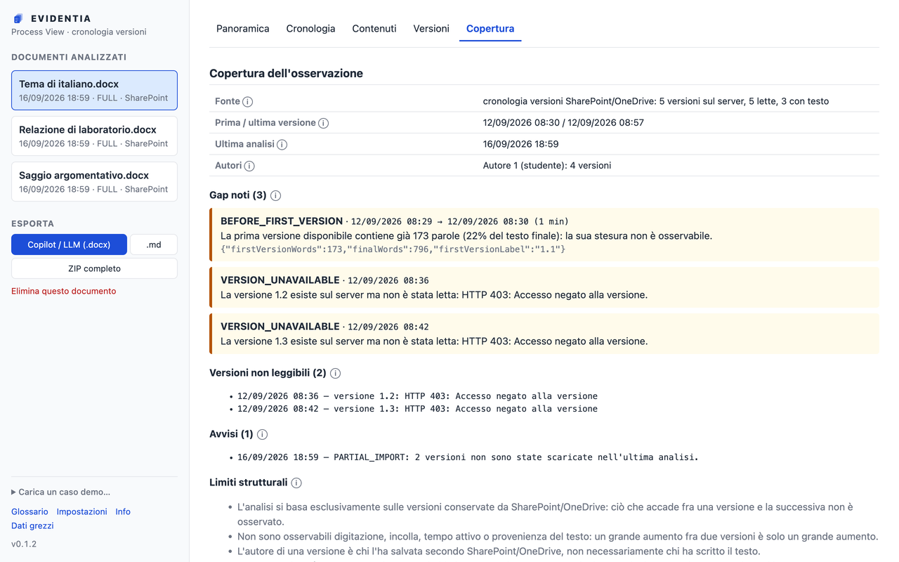

<div align="center">

<picture>
  <source media="(prefers-color-scheme: dark)" srcset="brand/png/lockup-horizontal-white-1600.png">
  
</picture>

**Rende visibile il processo con cui un testo è stato scritto,
a partire dalla cronologia delle versioni che il server conserva già.**

[](https://github.com/leonardoangelini/evidentia/actions/workflows/ci.yml)
[](LICENSE)
[](https://chromewebstore.google.com/detail/evidentia/fageecgkjgamdlmnbbfcploimdjdlbko)
[](#installazione)

</div>

---

Evidentia è un'estensione per browser rivolta ai **docenti**. Dato un documento
Word su SharePoint/OneDrive o un documento Google Docs, legge la cronologia
delle versioni che il server conserva e la trasforma in una ricostruzione
leggibile: quando si è lavorato, in quante sedute, cosa è comparso in ciascuna,
cosa è stato riscritto e cosa è stato eliminato.

Tutto avviene **nel browser del docente**. Non esiste un server di Evidentia,
non c'è telemetria, nessun testo viene inviato a servizi terzi.

> ### Cosa Evidentia non è
>
> **Non è un rilevatore di AI** e non dimostra chi abbia scritto un testo.
> Non produce punteggi di sospetto, percentuali di "testo generato" né
> attribuzioni di paternità — per scelta di progetto, non per limite tecnico.
>
> Rende osservabile *una parte* del processo di scrittura. L'interpretazione
> resta un atto didattico, che spetta al docente.

## Perché

Quando la domanda "come è nato questo testo?" si pone, di solito si hanno solo
due cose: il testo finale e un'impressione. Gli strumenti che promettono di
rilevare l'AI restituiscono un numero che non è verificabile, non è spiegabile
allo studente e sbaglia in modi che colpiscono chi scrive in modo atipico.

Intanto, un dato verificabile esiste già ed è ignorato: **SharePoint e Google
Drive conservano le versioni successive di ogni documento**. Sono fatti
osservabili, datati, attribuiti dal server, e il docente ha già il diritto di
vederli. Sono solo scomodi da consultare, una versione alla volta.

Evidentia parte da lì. Non aggiunge un giudizio: rende leggibile una traccia
che c'era già, distinguendo sempre ciò che è **osservato** da ciò che è
**derivato** per calcolo e da ciò che è una **stima**.

Il risultato serve a una conversazione con lo studente — "vedo che il capitolo
3 è comparso tutto insieme fra due versioni, raccontami come l'hai scritto" —
non a emettere un verdetto.

## Come funziona



Nel dettaglio:

1. **Riconoscimento.** Dall'URL della scheda aperta, Evidentia capisce di quale
   documento si tratta.
2. **Lettura delle versioni.** Per SharePoint usa la API REST del sito con la
   sessione Microsoft 365 già attiva del docente, in sola lettura. Per Google
   Docs usa la API Drive con un token OAuth che il docente concede
   esplicitamente e che è revocabile. Scarica ogni versione come DOCX e ne
   estrae il testo.
3. **Analisi.** Confronta le versioni fra loro e ricava sedute di lavoro, diff,
   grandi inserimenti, riscritture, metriche, stime di tempo e ritmo, e i
   **gap di osservazione** — gli intervalli in cui il server non ha conservato
   nulla, dichiarati apertamente invece che nascosti.
4. **Restituzione.** Interfaccia, report HTML, export per un LLM, dataset
   completo in ZIP.

### La regola che governa tutto

Ogni valore mostrato porta un'etichetta — **Osservato**, **Derivato**,
**Stima** — e un'icona "i" con la sua definizione: che cosa significa, come è
calcolato, come va letto. La scheda *Glossario* le raccoglie tutte, e le stesse
definizioni viaggiano nei report e negli export.

Il caso più importante è il tempo. **Il tempo di lavoro non è osservabile**: il
server registra quando una versione è stata salvata, non quanto si è scritto.
Evidentia lo stima (durata delle sedute più un margine di avvio, 5 minuti di
default) e lo presenta sempre come stima, con le sue avvertenze. Un documento
aperto senza modifiche, o il lavoro fatto fuori dal documento, non compaiono.

## Cosa mostra

<div align="center">
  
</div>

**Cronologia** — parole per versione, con le sedute di lavoro, i grandi
inserimenti, le revisioni e gli intervalli lunghi evidenziati; per ogni seduta
e per ogni giornata il tempo stimato, dichiarato come stima.

<div align="center">
  
</div>

**Contenuti** — quali sezioni e paragrafi sono comparsi, cambiati o
scomparsi in ogni seduta; da dove viene ogni paragrafo del testo finale; cosa è
stato eliminato lungo la strada.

<div align="center">
  
</div>

**Confronto versioni** — il diff parola per parola fra due versioni qualsiasi.

<div align="center">
  
</div>

**Copertura** — dove la cronologia è muta. È la scheda che impedisce di
scambiare l'assenza di dati per assenza di lavoro.

Più: la **Panoramica** (i numeri essenziali e i punti da guardare), le
**Versioni** (ogni versione con il passaggio dalla precedente: tipo di
cambiamento, parole aggiunte ed eliminate, grandi inserimenti con estratto) e,
in fondo alla barra laterale, **glossario**, **impostazioni**, **info** e
**dati grezzi**.

## Export e uso con un LLM

**Per Copilot, ChatGPT o Claude.** Il pulsante *Esporta per Copilot / LLM
(.docx)* produce un unico file Word con istruzioni, dati osservati, limiti e
testo della versione corrente. Si carica nella chat scrivendo "Segui le
istruzioni contenute nel documento". Stesso contenuto anche in Markdown.

Il nome visualizzato degli autori **non compare mai** nell'input per LLM: le
versioni sono attribuite a etichette pseudonime (`Autore 1`, `Autore 2`).

**Dataset completo.** Un ZIP con versioni, diff, sedute, metriche, evoluzione
dei contenuti, glossario, report HTML e una hash chain SHA-256 degli eventi.
Contenuto e schema: [docs/development.md](docs/development.md) e
[docs/data-model.md](docs/data-model.md).

## Privacy

- **Solo in locale.** I dati restano in IndexedDB nel browser del docente. Le
  uniche richieste di rete sono GET in sola lettura verso il server del
  documento.
- **Azione esplicita.** Nulla viene letto finché il docente non preme *Analizza
  cronologia versioni*.
- **Controllo.** Tutto ciò che è stato raccolto è ispezionabile (*Dati grezzi*),
  esportabile e cancellabile, per singolo documento o del tutto.
- **Pseudonimizzazione.** Gli autori sono etichette più un hash SHA-256
  dell'identità; il nome visualizzato si conserva solo in modalità FULL.
- **Modalità METRICS_ONLY.** Analisi senza conservare il testo delle versioni:
  solo conteggi e hash.

Testo completo: [PRIVACY.md](PRIVACY.md).

## Limiti noti

Dichiarati qui perché condizionano ogni lettura dei risultati.

- Fra due versioni non è osservato **nulla**: né digitazione, né incolla, né
  tempo attivo.
- Il tempo di lavoro è una **stima**, non una misura.
- Versioni cancellate o consolidate dal server non sono recuperabili. L'API di
  Google Drive espone solo una parte delle revisioni, più rada della cronologia
  dettagliata che si vede nell'editor.
- L'autore di una versione è **chi l'ha salvata**, non necessariamente chi ha
  scritto.
- La provenienza dei paragrafi segue le varianti con almeno il 50% di parole in
  comune nello stesso ordine: una riscrittura radicale appare come paragrafo
  nuovo più paragrafo eliminato.
- La hash chain rileva alterazioni accidentali di un export. **Non è una prova
  forense.**

## Installazione

Evidentia è pubblicata sul Chrome Web Store:

**➜ [Installa Evidentia](https://chromewebstore.google.com/detail/evidentia/fageecgkjgamdlmnbbfcploimdjdlbko)**

Funziona su Chrome e sui browser basati su Chromium (Edge, Brave, Vivaldi:
apri il link con quel browser e consenti l'installazione da Chrome Web Store).

Apri un documento Word su SharePoint/OneDrive o un documento Google Docs,
clicca l'icona di Evidentia → **Analizza cronologia versioni**.

### Installazione da sorgente

Per sviluppare o per provare una versione non ancora pubblicata:

```bash
git clone https://github.com/leonardoangelini/evidentia.git
cd evidentia
npm install
npm run build
```

Poi `chrome://extensions` (o `edge://extensions`) → modalità sviluppatore →
*Carica estensione non pacchettizzata* → cartella `.output/chrome-mv3`.

Una build da sorgente ha un ID estensione diverso da quello pubblicato, quindi
per Google Docs serve un client ID OAuth proprio: vedi
[docs/google-docs.md](docs/google-docs.md). Chi installa dal Chrome Web Store
non deve configurare nulla.

> **Preferisci guardare prima?** Apri la Process View: senza documenti propone
> i **casi demo**, cinque cronologie simulate, nessun documento reale.

### Se qualcosa non funziona

- **`HTTP 403 … unauthorized`** — la sessione Microsoft 365 è scaduta. Riapri
  il documento per rifare il login e ripeti l'analisi.
- **401/403 su Google Docs** — consenso mancante o account senza accesso al
  documento. Ripeti dal popup, oppure usa *Disconnetti Google* nelle
  impostazioni e riprova.

## Documentazione

| Documento | Contenuto |
|---|---|
| [docs/development.md](docs/development.md) | build, sviluppo, struttura del codice, test |
| [docs/architecture.md](docs/architecture.md) | analisi dei requisiti, architettura, scelte di progetto |
| [docs/data-model.md](docs/data-model.md) | modello dati e schema degli export |
| [docs/sharepoint.md](docs/sharepoint.md) | API SharePoint, lettura del DOCX, limiti |
| [docs/google-docs.md](docs/google-docs.md) | API Drive, OAuth, client ID, limiti delle revisioni |
| [docs/release.md](docs/release.md) | CI/CD e pubblicazione sul Chrome Web Store |
| [docs/store-listing.md](docs/store-listing.md) | testi della scheda Chrome Web Store |
| [PRIVACY.md](PRIVACY.md) | principi, modalità FULL / METRICS_ONLY, permessi |
| [brand/README.md](brand/README.md) | marchio, colori, file generati |

## Contribuire

Segnalazioni, correzioni e discussioni sul metodo sono benvenute — anche da chi
non scrive codice: un docente che descrive un caso reale in cui l'analisi
risulta fuorviante è un contributo prezioso.

Come partire, i vincoli di progetto da rispettare e i requisiti di una pull
request: [CONTRIBUTING.md](CONTRIBUTING.md).

Per una vulnerabilità non aprire una issue pubblica: [SECURITY.md](SECURITY.md).

## Licenza

[Apache License 2.0](LICENSE) — Copyright 2026 Leonardo Angelini.

Uso, modifica e ridistribuzione sono liberi, anche commerciali, a condizione di
mantenere avvisi di copyright e licenza, dichiarare le modifiche e includere il
file [NOTICE](NOTICE).

Il nome "Evidentia" e il marchio **non** sono coperti dalla licenza del codice
(Apache-2.0, sezione 6): un fork è libero di usare il codice, ma va distribuito
con nome e marchio propri. Font Manrope sotto SIL Open Font License 1.1.
