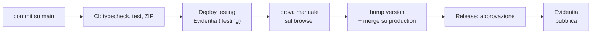

# Release — due ambienti sul Chrome Web Store

Evidentia esiste come **due item distinti** sullo store, alimentati dallo
stesso repository:

| Ambiente | Branch | Item sullo store | Environment GitHub | Deploy |
|---|---|---|---|---|
| **dev / testing** | `main` | *Evidentia (Testing)* — unlisted | `chrome-web-store-testing` | automatico a ogni push |
| **produzione** | `production` | *Evidentia* — pubblica | `chrome-web-store` | su merge, con approvazione |

Sono due estensioni diverse per Chrome: id diversi, dati diversi,
installabili affiancate nello stesso browser. Provare su testing non tocca
in alcun modo chi ha installato la pubblica.

Il pacchetto è lo stesso software in entrambi i casi: il canale
(`EVIDENTIA_CHANNEL`) cambia solo il nome visibile e la `version` del
manifest, mai il codice. Ciò che si prova sul canale testing è ciò che
verrà pubblicato.

## Flusso di lavoro



1. Si lavora su `main`. Ogni push esegue la CI e, se tocca il codice,
   aggiorna l'item di testing sullo store.
2. Si prova l'estensione di testing installata dal browser.
3. Quando main è pronto: si alza la `version` in `package.json` e si
   promuove `main` su `production`.
4. Il workflow *Release* si ferma in attesa di approvazione, poi pubblica e
   crea il tag `vX.Y.Z`.

### Workflow

| File | Ruolo |
|---|---|
| [`ci.yml`](../.github/workflows/ci.yml) | typecheck, test, ZIP di verifica su ogni push e PR. Non pubblica |
| [`publish.yml`](../.github/workflows/publish.yml) | la procedura di pubblicazione, una sola volta; invocata dagli altri due |
| [`deploy-testing.yml`](../.github/workflows/deploy-testing.yml) | push su `main` → item di testing |
| [`release.yml`](../.github/workflows/release.yml) | push su `production` → item pubblico |
| [`store-status.yml`](../.github/workflows/store-status.yml) | stato di un item, a scelta. Sola lettura |

Testing e produzione passano dallo **stesso** `publish.yml`: la procedura di
rilascio è provata a ogni push su main, non solo il giorno della release.

## 1. Creare i due item — a mano, una volta sola

L'API del Chrome Web Store aggiorna un'estensione esistente: non può crearne
una. Il primo upload di **ciascun** item va fatto dalla dashboard
<https://chrome.google.com/webstore/devconsole>.

Per l'item di **testing**:

1. `EVIDENTIA_CHANNEL=testing npm run zip` → `.output/evidentia-<version>-chrome.zip`
   (il manifest dirà `Evidentia (Testing)`).
2. "Add new item", carica lo ZIP.
3. Scheda minima: bastano descrizione breve, uno screenshot e l'icona — non
   deve attrarre nessuno.
4. **Visibilità: Unlisted.** Raggiungibile solo da chi ha il link, non
   compare nelle ricerche. In alternativa *Private* con i tester elencati.
5. Annota **Extension ID** e la **chiave pubblica** (dashboard → *Package →
   View public key*): quest'ultima va in `.env` come `WXT_EXTENSION_KEY`, così
   le build locali hanno lo stesso id dell'item di testing e un solo redirect
   URI OAuth da registrare.

Per l'item di **produzione**: come sopra ma con
`EVIDENTIA_CHANNEL=production`, visibilità *Public*, e la scheda completa —
almeno **1 screenshot 1280×800**, icona 128, categoria, lingua, URL privacy.
Testi pronti: [store-listing.md](store-listing.md).

> Sezione **Privacy practices**: dichiara `storage`, `tabs`, `identity`, gli
> host `*.sharepoint.com` e quelli opzionali Google, motivando ogni permesso.
> È la causa più frequente di rifiuto. Materiale: [PRIVACY.md](../PRIVACY.md).

Annota per entrambi:

- **Extension ID** (32 lettere, nell'URL della pagina dell'item)
- **Publisher ID** (dashboard → *Publisher → Settings*; lo stesso per i due item)

## 2. Service account Google (auth per la CI)

Guida ufficiale: <https://developer.chrome.com/docs/webstore/service-accounts>

Uno solo, valido per entrambi gli item: appartiene al publisher, non all'item.

1. Crea/usa un progetto su <https://console.cloud.google.com>.
2. Abilita la **Chrome Web Store API**.
3. Crea un **service account** e scarica la chiave **JSON**
   (nella guida: sezione "Obtain access tokens" → "Use a JSON Web Token";
   fermati dopo il download).
4. Nella dashboard del Web Store, sezione **Account**, incolla l'email del
   service account e dagli accesso.

## 3. Configurare i due environment

`Settings → Environments`. Servono **`chrome-web-store-testing`** e
**`chrome-web-store`**.

Quasi tutte le credenziali sono condivise: conviene metterle come **secret di
repository** e sovrascrivere nell'environment solo ciò che cambia. Un secret
d'environment vince su quello di repository con lo stesso nome.

Secret di **repository** (uguali per i due ambienti):

| Secret | Valore |
|---|---|
| `CHROME_PUBLISHER_ID` | Publisher ID |
| `CHROME_SERVICE_ACCOUNT_CLIENT_EMAIL` | `client_email` del JSON |
| `CHROME_SERVICE_ACCOUNT_PRIVATE_KEY_B64` | `private_key` in base64 (vedi sotto) |

Secret di **environment** (diverso per ciascuno):

| Secret | `chrome-web-store-testing` | `chrome-web-store` |
|---|---|---|
| `CHROME_EXTENSION_ID` | id dell'item di testing | id dell'item pubblico |

Variabile di **environment** (scheda *Variables*; non è un segreto — il client
ID OAuth finisce nel bundle ed è pubblico per definizione, un public client
non ha client secret):

| Variabile | Valore |
|---|---|
| `WXT_GOOGLE_CLIENT_ID` (opzionale) | client ID OAuth compilato nella build per Google Docs. Se assente, ogni scuola inserisce il proprio nelle impostazioni. Vedi [google-docs.md](google-docs.md) |

La chiave PEM contiene a-capo: si conserva in base64 e il workflow la decodifica.

```sh
node -p "Buffer.from(require('./sa.json').private_key).toString('base64')"
```

### Approvazione manuale della produzione

Su `chrome-web-store`, *Required reviewers* con te stesso: il job si ferma in
attesa del tuo OK prima di caricare qualsiasi cosa. Su
`chrome-web-store-testing` **non** metterli, altrimenti ogni push su main
aspetterebbe un click e il senso dell'ambiente di sviluppo verrebbe meno.

Limita anche i branch che possono usare ciascun environment (*Deployment
branches*): `production` per l'uno, `main` per l'altro. Senza, un branch
qualunque potrebbe pubblicare.

> Su un repository pubblico i secret **non** sono esposti alle pull request
> provenienti da un fork: GitHub non li passa. I workflow di deploy non
> girano comunque sulle PR.

## 4. Rilasciare in produzione

```sh
git checkout main && git pull
npm version patch          # alza package.json; crea anche un commit
git push

git checkout production && git pull
git merge --ff-only main
git push                   # avvia Release
```

Poi approva da *Actions* o dalla notifica. A pubblicazione avvenuta il
workflow crea il tag `vX.Y.Z`.

Il job `guard` rifiuta la release se esiste già il tag `v<version>`: è la
rete contro il "ho dimenticato di alzare la version", che altrimenti si
scoprirebbe solo quando lo store rigetta l'upload.

Prima di un rilascio delicato: *Actions → Release → Run workflow* con
`dry_run` su `true`. Verifica credenziali e ZIP senza caricare nulla e senza
creare tag.

## 5. Versioni

- **Produzione**: `X.Y.Z`, da `package.json`.
- **Testing**: `X.Y.Z.<numero di run>` — lo store rifiuta un upload con una
  version già presente sull'item, e il canale testing pubblica a ogni push.
  `version_name` mostra `X.Y.Z testing <n>` nella pagina delle estensioni.

Le due sequenze sono indipendenti: sono item diversi.

Il canale testing passa `--chrome-cancel-pending`: un nuovo push annulla la
submission ancora in review invece di accodarsi.

## Note

- **Edge**: stesso ZIP. Si aggiunge `--edge-zip` al comando di publish con le
  credenziali del Partner Center.
- La CI usa `publish-browser-extension` (già dipendenza di wxt) con l'API v2 del
  Web Store, quella basata su service account.
- La versione di Node nei workflow (`26`) va tenuta allineata a quella di
  sviluppo; il minimo supportato è dichiarato in `engines` di `package.json`.
- Per caricare senza sottomettere a review: `--chrome-skip-submit-review`.
- Un push su `main` che tocca solo documentazione non fa partire un deploy
  (vedi `paths-ignore` in `deploy-testing.yml`).
