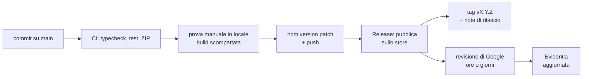

# Release — pubblicare sul Chrome Web Store

Evidentia esiste come **un solo item** sullo store, alimentato dal branch
`main`:

| Da cosa parte | Item sullo store | Environment GitHub | Deploy |
|---|---|---|---|
| un bump di `version` su `main` | *Evidentia* — pubblica | `chrome-web-store` | automatico |

Un solo branch, `main`, e nessun gesto manuale oltre al bump: si rilascia con
`npm version patch && git push`. Non esiste un branch di release, e il tag non
si crea a mano — lo crea il workflow **dopo** la pubblicazione, così un tag
esiste solo per ciò che è stato davvero inviato allo store.

> **Pubblicare non è mandare online.** Il Chrome Web Store riceve la
> submission e la mette in revisione: è Google a decidere quando
> l'aggiornamento raggiunge chi ha l'estensione installata, di norma in ore
> o giorni. L'automazione copre tutto ciò che sta prima; l'ultimo tratto non
> è nostro, e non lo sarà mai.

Prima del rilascio si prova in locale, con la build scompattata: il canale
(`EVIDENTIA_CHANNEL`) le dà un nome e una version diversi — *Evidentia
(Testing)* — così convive nello stesso browser con l'estensione pubblica,
senza mescolarne i dati. Il canale non cambia mai il codice: ciò che si prova
è ciò che si pubblica.

## Flusso di lavoro



1. Si lavora su `main`. Ogni push esegue la CI, che verifica e lascia lo ZIP
   fra gli artefatti. Non pubblica nulla.
2. Si prova l'estensione in locale (`npm run dev`, oppure lo ZIP della CI
   caricato con *Carica estensione non pacchettizzata*).
3. Quando main è pronto: `npm version patch && git push`. Nient'altro.
4. *Release* vede la `version` cambiata, verifica che quel tag non esista già,
   pubblica e poi crea tag e Release con le note.

### Workflow

| File | Ruolo |
|---|---|
| [`ci.yml`](../.github/workflows/ci.yml) | typecheck, test, ZIP di verifica su ogni push e PR. Non pubblica |
| [`release.yml`](../.github/workflows/release.yml) | bump di `version` su `main` → item pubblico, poi tag e Release |
| [`store-status.yml`](../.github/workflows/store-status.yml) | stato dell'item sullo store. Sola lettura |

## 1. Creare l'item — a mano, una volta sola

L'API del Chrome Web Store aggiorna un'estensione esistente: non può crearne
una. Il primo upload va fatto dalla dashboard
<https://chrome.google.com/webstore/devconsole>.

1. `EVIDENTIA_CHANNEL=production npm run zip` → `.output/evidentia-<version>-chrome.zip`
2. "Add new item", carica lo ZIP.
3. Visibilità *Public* e scheda completa — almeno **1 screenshot 1280×800**,
   icona 128, categoria, lingua, URL privacy. Testi pronti:
   [store-listing.md](store-listing.md).

> Sezione **Privacy practices**: dichiara `storage`, `activeTab`, `identity` e
> gli host opzionali SharePoint e Google, motivando ogni permesso. Quando il
> manifest cambia permessi, le giustificazioni vanno aggiornate prima del
> push, o la submission fallisce.
> È la causa più frequente di rifiuto. Materiale: [PRIVACY.md](../PRIVACY.md).

Una scheda incompleta non fa fallire l'upload dello ZIP ma la **submission**,
con `400 INVALID_ITEM_METADATA`: il pacchetto è valido, è la pagina dell'item
a non esserlo. Si corregge dalla dashboard, non da qui.

Annota:

- **Extension ID** (32 lettere, nell'URL della pagina dell'item)
- **Publisher ID** (dashboard → *Publisher → Settings*)

## 2. Service account Google (auth per la CI)

Guida ufficiale: <https://developer.chrome.com/docs/webstore/service-accounts>

1. Crea/usa un progetto su <https://console.cloud.google.com>.
2. Abilita la **Chrome Web Store API**.
3. Crea un **service account** e scarica la chiave **JSON**
   (nella guida: sezione "Obtain access tokens" → "Use a JSON Web Token";
   fermati dopo il download).
4. Nella dashboard del Web Store, sezione **Account**, incolla l'email del
   service account e dagli accesso.

## 3. Configurare l'environment

`Settings → Environments` → **`chrome-web-store`**.

I secret possono stare a livello di repository o di environment: tenerli
sull'environment li rende raggiungibili solo dai job che lo dichiarano, che è
il motivo per cui l'environment esiste. Un secret d'environment vince su
quello di repository con lo stesso nome.

| Secret | Valore |
|---|---|
| `CHROME_EXTENSION_ID` | Extension ID dell'item |
| `CHROME_PUBLISHER_ID` | Publisher ID |
| `CHROME_SERVICE_ACCOUNT_CLIENT_EMAIL` | `client_email` del JSON |
| `CHROME_SERVICE_ACCOUNT_PRIVATE_KEY_B64` | `private_key` in base64 (vedi sotto) |

Variabile (scheda *Variables*; non è un segreto — il client ID OAuth finisce
nel bundle ed è pubblico per definizione, un public client non ha client
secret):

| Variabile | Valore |
|---|---|
| `WXT_GOOGLE_CLIENT_ID` (opzionale) | client ID OAuth compilato nella build per Google Docs. Se assente, ogni scuola inserisce il proprio nelle impostazioni. Vedi [google-docs.md](google-docs.md) |

La chiave PEM contiene a-capo: si conserva in base64 e il workflow la decodifica.

```sh
node -p "Buffer.from(require('./sa.json').private_key).toString('base64')"
```

### Approvazione: nessuna, di proposito

Niente *Required reviewers* sull'environment. Il gesto deliberato è già il
bump di `version`: chiedere un'approvazione dopo significherebbe far
confermare due volte la stessa intenzione, e il click di troppo si trasforma
presto in un click distratto.

Il gate serviva quando un trigger poteva scattare per sbaglio — un tag spinto
a mano, un merge su un branch di release. Ora l'unico innesco è una riga di
`package.json` che cambia, e chi la cambia sa cosa sta facendo. Resta il dry
run per i rilasci delicati.

Limita invece i ref che possono usare l'environment (*Deployment branches and
tags*): **`main`**. È l'unico ref da cui gira qualcosa — pubblicazione, dry
run e *Store status* — e basta a impedire che un branch qualunque pubblichi.

> Su un repository pubblico i secret **non** sono esposti alle pull request
> provenienti da un fork: GitHub non li passa. Il workflow di rilascio non
> gira comunque sulle PR.

## 4. Rilasciare

Prima il changelog, poi la version:

```sh
git checkout main && git pull
$EDITOR CHANGELOG.md                     # una sezione `## X.Y.Z — AAAA-MM-GG`
npm version patch --no-git-tag-version   # alza package.json; il tag lo crea la CI
git commit -am "chore: v$(node -p "require('./package.json').version")"
git push
```

[CHANGELOG.md](../CHANGELOG.md) non è solo per chi legge il repository: è
incluso nel pacchetto e la scheda *Info* dell'estensione lo mostra. Un test
fallisce se `package.json` porta una version che il changelog non descrive,
così non si pubblica una versione muta.

Fine. Il workflow *Release* si accorge che `package.json` è cambiato,
controlla che il tag `v<version>` non esista già, pubblica sullo store e solo
allora crea tag e Release con le note generate.

Il controllo sul tag è la rete contro il "ho dimenticato di alzare la
version": un `package.json` che cambia per una dipendenza non fa partire
nessuna pubblicazione, e una version già rilasciata viene saltata con un
avviso invece di finire in un upload che lo store rigetta.

### Perché il tag lo crea la CI, dopo

Un tag messo a mano *prima* è una promessa che il rilascio non ha ancora
mantenuto: se la pubblicazione fallisce, resta a dire il falso. Creato dopo,
un tag significa esattamente "questo è stato inviato allo store".

C'è anche un motivo tecnico per cui la pubblicazione non parte dall'evento
`release`: una Release creata con il `GITHUB_TOKEN` non fa scattare altri
workflow — GitHub lo impedisce per evitare ricorsioni — quindi la catena
"crea release → pubblica" si spezzerebbe da sola.

> Attenzione a `npm version` senza `--no-git-tag-version`: crea un tag
> locale che, se spinto, farebbe saltare il rilascio successivo — il workflow
> vedrebbe quella version come già rilasciata.

Prima di un rilascio delicato: *Actions → Release → Run workflow* con
`dry_run` su `true`. Verifica credenziali e pacchetto senza caricare nulla,
senza creare tag, e gira anche su una version già pubblicata.

## 5. Versioni

- **Produzione**: `X.Y.Z`, da `package.json`.
- **Build di testing** (locali e artefatti della CI): `X.Y.Z.<numero di run>`,
  con `version_name` `X.Y.Z testing <n>` nella pagina delle estensioni, così
  due artefatti costruiti dalla stessa version restano distinguibili.

La version installata si legge anche dentro l'estensione, senza passare dalla
pagina delle estensioni del browser: in fondo al popup e sotto il titolo nella
barra laterale della Process View. Su una build di testing è la stessa stringa
di `version_name`, numero di build compreso, così una segnalazione dice sempre
quale pacchetto era installato.

## Note

- **Edge**: stesso ZIP. Si aggiunge `--edge-zip` al comando di publish con le
  credenziali del Partner Center.
- La CI usa `publish-browser-extension` (già dipendenza di wxt) con l'API v2 del
  Web Store, quella basata su service account.
- La versione di Node nei workflow (`26`) va tenuta allineata a quella di
  sviluppo; il minimo supportato è dichiarato in `engines` di `package.json`.
- Per caricare senza sottomettere a review: `--chrome-skip-submit-review`.
